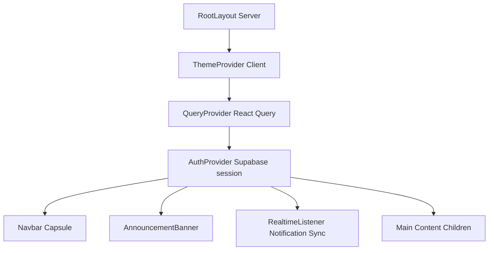

# CIVIQ — Engineering Audit Report

This report presents a thorough review of the system architecture, file routing directories, component separation boundaries, and runtime state management for the CIVIQ community intelligence platform.

---

## 1. Directory Structure & Aliasing

The codebase conforms to Next.js 15 (App Router) structures and uses absolute module paths mapped via TypeScript aliases:

* `@/*` points directly to the project root folder.
* **Route Structure**: Pages are located inside `app/` and leverage dynamic routing parameters for report details (`app/report/[id]/page.tsx`) and auth redirects.
* **Component Splitting**: Core components are stored under `components/` grouped by feature:
  * `components/admin/`: Dispatch consoles and composition utilities.
  * `components/analytics/`: Operational charts and statistics.
  * `components/auth/`: Sign-in cards and social credentials.
  * `components/feed/`: Timeline feeds and filter selectors.
  * `components/presence/`: Citizen online widgets.
  * `components/report/`: AI classifications, location pickers, and submission multi-step modules.

---

## 2. Server vs. Client Component Boundaries

The project enforces clean separation between static server-rendered wrappers and interactive client interfaces:

* **App Layout** ([layout.tsx](file:///a:/Project/Vibe2Ship/CIVIQ/app/layout.tsx)): Rendered on the server. Fetches active user state synchronously to initialize the `RealtimeListener` with exact IDs, avoiding client-side layout shifts.
* **Individual Routes**:
  * `/feed/page.tsx`: Server component that fetches session user details, passing them to the interactive `FeedClient`.
  * `/report/[id]/page.tsx`: Server component resolving the dynamic `params` promise before mounting the detailed `ReportDetailClient` component.
  * `/admin/page.tsx`: Server-side check that retrieves all service requests and dispatches them to the `AdminDashboardClient` workspace.
* **Client Pages/Hooks**: Use `'use client'` at the top of files to enable state tracking (`useState`, `useEffect`), framer-motion animations, and TanStack React Query cache operations.

---

## 3. Provider & State Management Hierarchy

Global states are nested inside `app/layout.tsx` to ensure proper context inheritance:

* **QueryProvider**: Manages API caching and optimistic state updates for comments, votes, and reports.
* **AuthProvider**: Listens to Supabase Auth state changes to synchronize user profiles and session tokens.

---

## 4. Real-Time WebSocket & Presence Subscriptions

* **Replication**: Configured via Supabase Realtime postgres changes on `reports`, `comments`, `votes`, `report_verifications`, and `user_presence` tables.
* **Memory Leaks & Churn Avoidance**: The socket listener (`hooks/useRealtimeFeed.ts`) is designed to remain permanently open across filters. On updates, it scans the React Query cache using `queryClient.getQueryCache().findAll()` and updates only matching filtered collections in-memory.
* **Presence**: Presence status (`online` / `away` / `offline`) coordinates with the page tab visibility API (`document.addEventListener('visibilitychange')`), updating states inside the `user_presence` database table to track active operators and citizens.

---

## 5. Security & Access Control

* **Row Level Security (RLS)**: Enforced on all Supabase tables. 
  * `profiles`: Select operations are readable by any citizen (`using (true)`) to display commenter initials and names, while modifications are restricted to owners (`using (auth.uid() = id)`).
  * `user_presence`: Updates and deletes require exact UID validation matching `auth.uid()`.
* **Server Actions**: All administrative actions (assigning departments, updating statuses, logging dispatches, creating announcements) verify the caller's session on the server to prevent malicious client requests.
